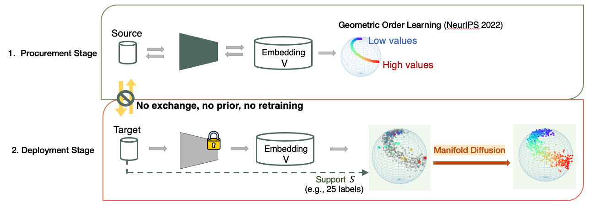
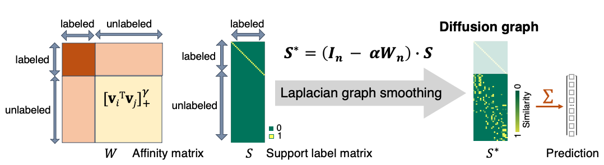

# Towards "universal" regression models: Domain adaptive regression with ordered embedding space

:cartwheeling: Visit our project page [here](https://dgominski.github.io/drift/)

Our work addresses the generalization challenge of image regression models: these models are often sensitive to data distributions
and thus can easily fail on a new domain (unseen datasets, unseen tasks). Our goal is build a **"universal"** model that could 
be trained on any source data, and later on adapted to any target domain data.


Figure 1: Overview of the workflow. We assume two stages for deploying a "universal" model. In the procurement stage, we 
are free to train the model with (label-rich) source domain data, without knowing what future data/tasks it will face; In the deployment stage, we apply the model to "any"
new dataset, without any information exchange with the source data, no prior knowledge, and no retraining. Our model must
generalize to "any" new data or tasks. 


Our contributions are:

* We propose to prepare the model for generalization by organizing the embedding space, using only source domain data.

* The model is then adapted to unseen target domains with few-shot labels, using only target domain data.

* We propose a generalization of manifold diffusion to regression tasks, which demonstrated some potential over simple distance-based measures like kNN, see below.


## 0. Dependencies


```
conda env create -f environment.yml
```


---

## 1. Procurement Stage
### Train the feature extractor to establish ordered embedding space using source domain data:

```
python Procurement_train_GOL.py
```

---
For baseline comparison, train a vanilla regressor to predict values directly:

```
python Procurement_train_regressor.py
```

---

## 2. Deployment Stage

### Few-shot adaptation on target domain data

* No fine-tuning, no source domain access, 5*5=25 labels accessible in the target domain (main proposed setup in the paper)

```
python Deployment_few_shot_adaption.py
```

-----

* Alternatively, fine-tune the model with few-shot labels in the target domain

```
python Deployment_finetune_GOL.py
```

```
python Deployment_finetune_regressor.py
```

-----

## 3. Manifold Diffusion for Regression

A distance measure in the high-dimensional manifold structure, taking into account both labeled and unlabeled data.
Read our [paper](https://arxiv.org/abs/2405.00514) for more details.




Code implementation in `utils/diffusion.py`:

```
class Diffuser(...)
    
    ...
    
    def diffuse_pred(...):
        ...

```


Figure: Manifold diffusion for regression vs. vanilla kNN label assignment.


---

### Main code reference:

* Geometric order learning (Lee et al, NeurIPS 2022): https://github.com/seon92/GOL
* Manifold diffusion for classification (Iscen et al, CVPR 2019): https://github.com/ahmetius/LP-DeepSSL


