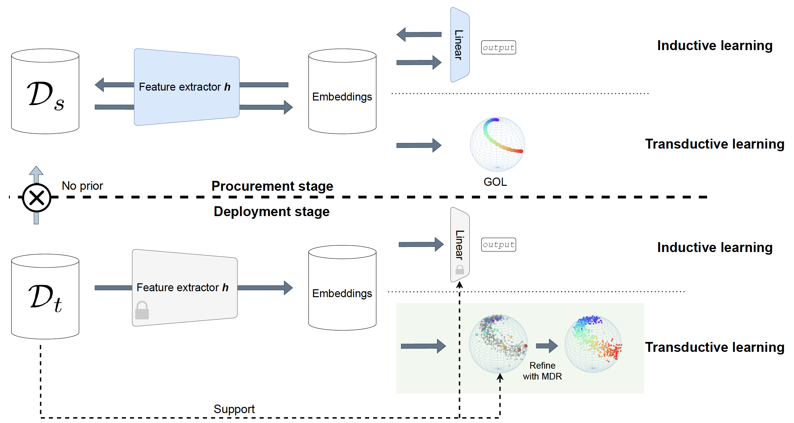
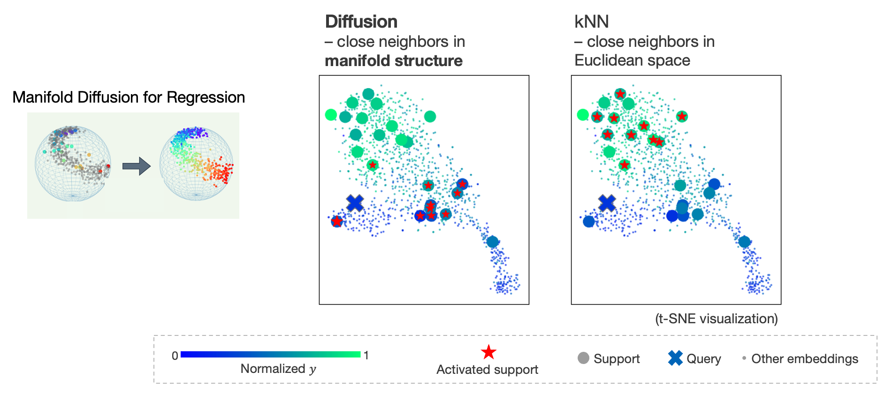

# Domain adaptive regression with ordered embedding space

:cartwheeling: Visit our project page [here](https://dgominski.github.io/drift/)

* We propose to prepare the model for generalization by organizing the embedding space, using only source domain data.

* The model is then adapted to unseen target domains with few-shot labels, using only target domain data.

* We propose a generalization of manifold diffusion to regression tasks, which demonstrated some potential over simple distance-based measures like kNN, see below.


Figure 1: overview.


## 0. Dependencies


```
conda env create -f environment.yml
```


---

## 1. Procurement Stage
### Train the feature extractor to establish ordered embedding space using source domain data:

```
python Procurement_train_GOL.py
```

---
For baseline comparison, train a vanilla regressor to predict values directly:

```
python Procurement_train_regressor.py
```

---

## 2. Deployment Stage

### Few-shot adaptation on target domain data

* No fine-tuning, no source domain access, 5*5=25 labels accessible in the target domain (main proposed setup in the paper)

```
python Deployment_few_shot_adaption.py
```

-----

* Alternatively, fine-tune the model with few-shot labels in the target domain

```
python Deployment_finetune_GOL.py
```

```
python Deployment_finetune_regressor.py
```

-----

## 3. Manifold Diffusion for Regression

A distance measure in the high-dimensional manifold structure, taking into account both labeled and unlabeled data.

Code implementation in `utils/diffusion.py`:

```
class Diffuser(...)
    
    ...
    
    def diffuse_pred(...):
        ...

```



Figure 2: Manifold diffusion for regression vs. vanilla kNN label assignment.


---

### Main code reference:

* Geometric order learning (Lee et al, NeurIPS 2022): https://github.com/seon92/GOL
* Manifold diffusion for classification (Iscen et al, CVPR 2019): https://github.com/ahmetius/LP-DeepSSL


